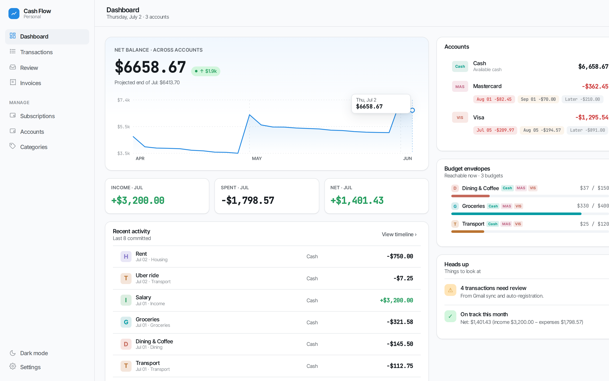
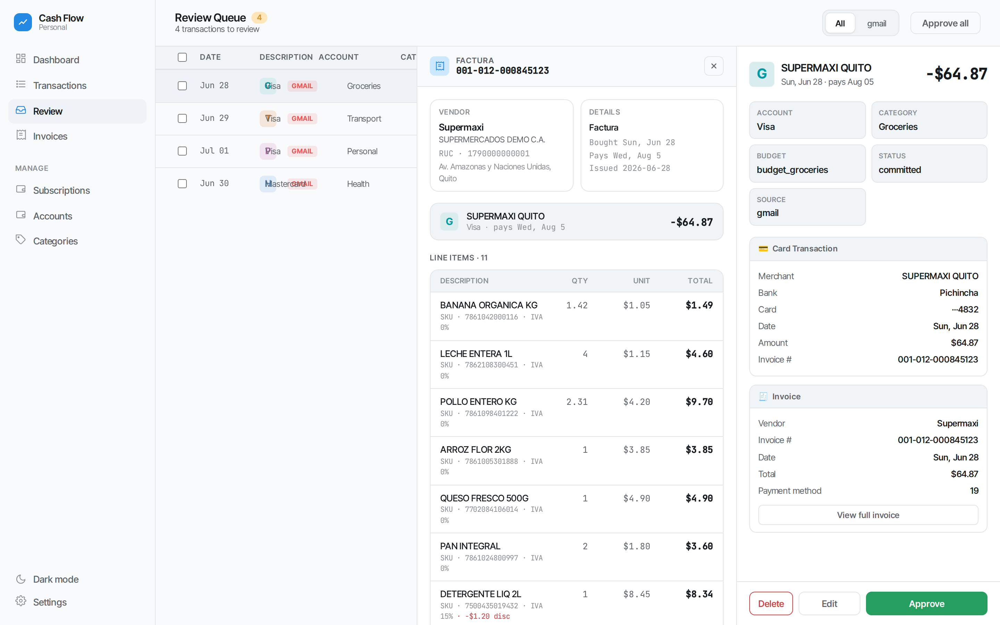
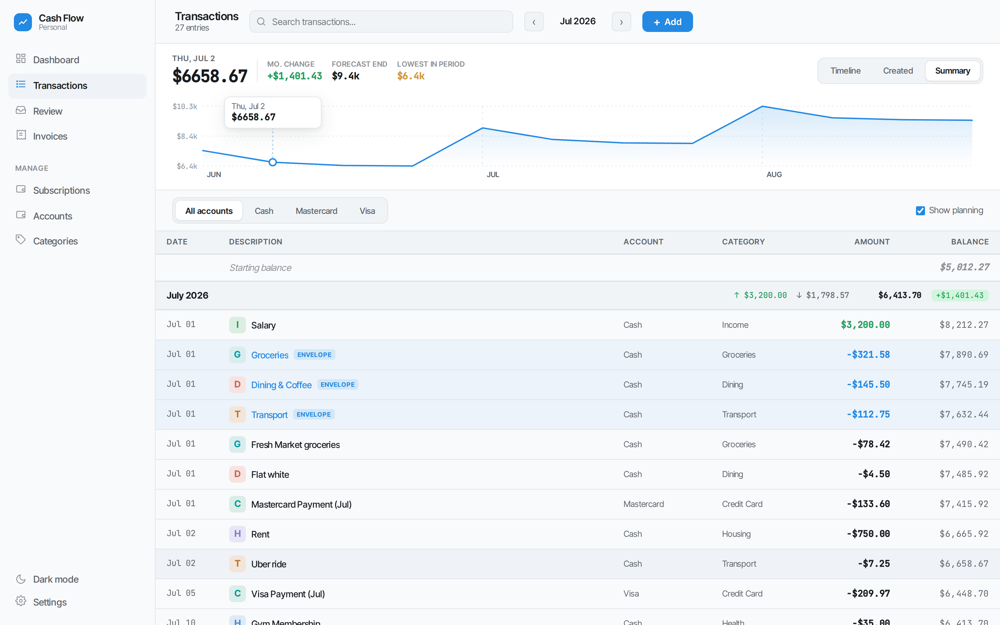

# Cash Flow

Self-hosted personal finance with **budget envelopes**, **credit-card-cycle-aware forecasting**, and an automation pipeline that turns your bank's notification emails into categorized transactions — you just review and approve.

<picture>
  <source media="(prefers-color-scheme: dark)" srcset="docs/screenshots/dashboard-dark.png">
  
</picture>

## Why

Most finance trackers die from manual data entry. This one automates the capture end-to-end:

```
 bank emails ──► parsers ──► rules / LLM classifier ──► review queue ──► your timeline
 SRI invoices ──► line items ──────► matched to card transactions ──┘
```

- **Automatic capture** — credit card purchase notifications (Pichincha, Diners, Produbanco) and bank transfers are pulled from Gmail on a schedule, parsed, and registered. Electronic invoices (SRI, Ecuador) are matched to card purchases, so a `$64.87 SUPERMAXI` charge comes with its full line-item receipt.
- **Approve, don't type** — everything automated lands in a review queue flagged with its source email, matched invoice, and the classifier's reasoning. Nothing enters your timeline silently.
- **Budget envelopes that are real transactions** — allocations reserve money in the timeline itself; spending shrinks the envelope while the running balance shows true disposable cash. No double-counting.
- **One timeline, two dates** — every transaction has a purchase date and a cash-impact date. Credit card purchases land on the statement's payment day, so the forecast shows what you'll actually have on any future date, installments included.
- **Single SQLite file** — all interfaces (web, CLI, Telegram) share one `cash_flow.db`. Auto-backup before every mutation.

## The review queue

<picture>
  <source media="(prefers-color-scheme: dark)" srcset="docs/screenshots/review-invoice-dark.png">
  
</picture>

Each auto-registered transaction shows the parsed card notification, the matched invoice with line items, and the assigned category/budget. Approve, edit, or batch-approve.

## The timeline

<picture>
  <source media="(prefers-color-scheme: dark)" srcset="docs/screenshots/transactions-dark.png">
  
</picture>

Past and forecast in one view: subscriptions, budget envelopes, installments, and credit card payment cycles — with the running balance projected forward.

## Quick start

```bash
git clone <repo-url> && cd cash_flow
cp env.example .env            # set WEB_PASSWORD at minimum
docker compose up -d --build   # → http://localhost:8787
```

Or without Docker:

```bash
pip install -r requirements.txt
WEB_PASSWORD=yourpassword uvicorn api.app:app --port 8000
```

The web UI works with zero further configuration. Optional integrations:

- **Gmail sync** — connect from *Settings → Gmail* (OAuth, read-only). See [docs/gmail-sync.md](docs/gmail-sync.md).
- **LLM** — free Gemini key and/or local Ollama for natural-language input and merchant classification. See [docs/llm.md](docs/llm.md).

## Other interfaces

**CLI** — everything is scriptable, with interactive guided modes that need no LLM:

```bash
python3 cli.py add "Spent 45.50 on groceries at Supermaxi today on Visa"   # natural language
python3 cli.py add -i                                                      # guided, offline
python3 cli.py view -m 6                                                   # timeline + forecast
python3 cli.py liabilities                                                 # CC debt per cycle
python3 cli.py fix --payment Visa -i                                       # statement reconciliation
```

**Telegram bot** — track on the go: message *"Lunch 12.50 on Cash"*, get a preview with confirm/revise buttons. Family members can log shared expenses as delegate users; their entries are flagged for your review.

```
📊 Budgets: March 2026

🟢 Groceries      $250.45 of $400.00 | $149.55 left
🟡 Transport       $85.00 of $100.00 |  $15.00 left
🔴 Dining         $120.00 of  $80.00 |  $40.00 over
```

## Documentation

| Doc | Contents |
|-----|----------|
| [docs/web.md](docs/web.md) | Web dashboard: pages, deployment, configuration |
| [docs/concepts.md](docs/concepts.md) | Envelopes, two-date model, statuses, CC cycles, rollover |
| [docs/gmail-sync.md](docs/gmail-sync.md) | Automated capture: consumo + invoice pipelines, rules, scheduling |
| [docs/cli.md](docs/cli.md) | Full CLI reference, workflows, troubleshooting |
| [docs/telegram-bot.md](docs/telegram-bot.md) | Bot setup, delegate users, review flow |
| [docs/llm.md](docs/llm.md) | LLM providers, hybrid local/cloud routing, benchmarks |
| [docs/architecture.md](docs/architecture.md) | Stack, project layout, schema, testing |

## Stack

Python · FastAPI · SQLite · React + TypeScript · LiteLLM (Gemini / Ollama / any provider) · python-telegram-bot · Docker

## License

MIT
