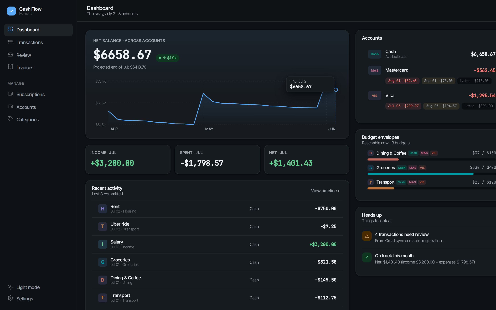
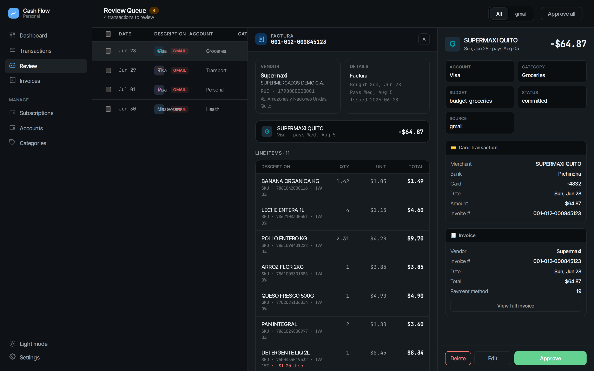
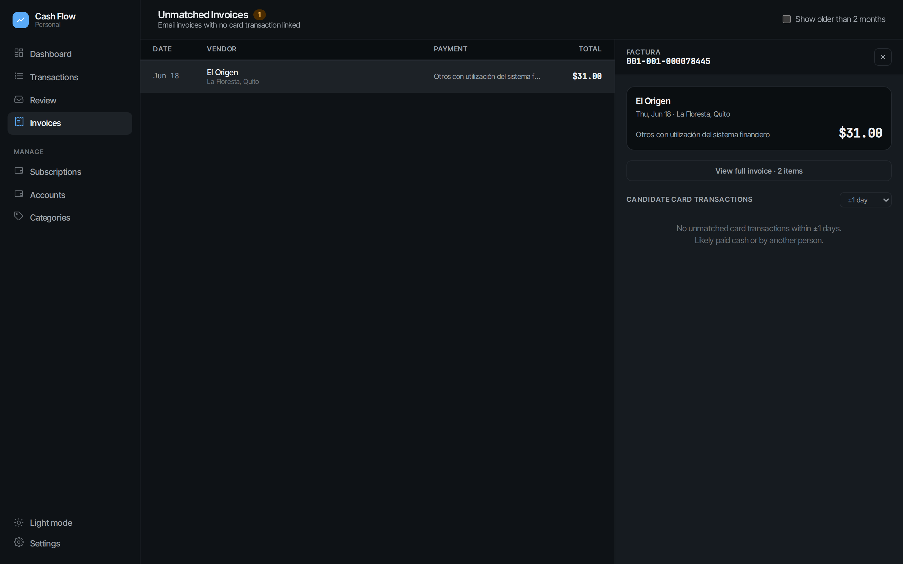
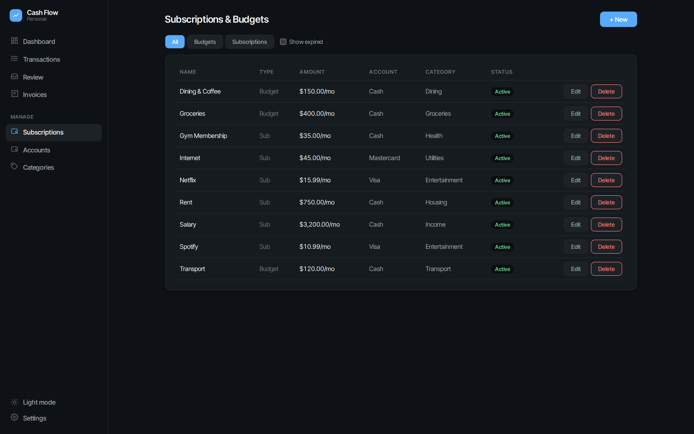

# Web Dashboard

The web app is the primary interface: a single-page React dashboard served by a FastAPI backend, backed by the same `cash_flow.db` as the CLI and Telegram bot.



## Running

### Docker (recommended)

```bash
cp env.example .env        # set WEB_PASSWORD at minimum
docker compose up -d --build
```

The app is served on `http://localhost:8787` (container port 8000).

### Bare uvicorn

```bash
pip install -r requirements.txt
WEB_PASSWORD=yourpassword uvicorn api.app:app --host 0.0.0.0 --port 8000
```

The frontend is pre-built into `static/` — no Node.js required to run it.

### Configuration

| Variable | Default | Description |
|----------|---------|-------------|
| `WEB_PASSWORD` | — (required) | Login password. Login is disabled until set. |
| `WEB_SECRET_KEY` | random per boot | JWT signing key. Set it to keep sessions valid across restarts. |
| `WEB_TOKEN_EXPIRY_HOURS` | `24` | Session lifetime. |
| `WEB_DEV_MODE` | `false` | Allows the session cookie over plain HTTP (set `true` behind Tailscale/LAN without TLS). |
| `GMAIL_REDIRECT_BASE_URL` | — | Public base URL used for the Gmail OAuth callback (Settings → Gmail). |

Auth details: single-user password login (bcrypt), httpOnly `session` cookie, strict SameSite, 5 attempts/min rate limit.

## Pages

### Dashboard
Net balance with an interactive, scrubbable history chart, month KPIs (income / spent / net), per-account cards — credit cards show what's owed per billing cycle (current bill, next bill, later) — budget envelope progress bars, recent activity, and a "Heads up" panel (pending reviews, overspent budgets, month net).

### Transactions
The full timeline with running balance and forecast horizon. Three view modes — **Timeline** (by payment date), **Created** (by purchase date), **Summary** (CC purchases aggregated into one payment row per cycle) — plus month navigation, account filter tabs, full-text search, a planning toggle, and inline add. Clicking any row opens a detail drawer; installments and splits are grouped.

### Review
The approval queue for everything the Gmail pipeline auto-registered (see [Gmail sync](gmail-sync.md)). Each item shows the parsed **card transaction** (merchant, bank, card, amount), the matched **SRI invoice** with line items when one was found, and the **LLM classification decision** when rules didn't cover the merchant. Approve/edit/delete one by one (with keyboard navigation) or batch-approve everything.



### Invoices
Electronic invoices that arrived by email but have no card transaction linked yet — e.g. paid in cash or by someone else. Shows candidate card transactions within a configurable date window and lets you link (optionally adopting the invoice total as the true amount) or view the full line-item breakdown.



### Subscriptions & Budgets
Create, edit, and end recurring subscriptions and budget envelopes. Budgets show as envelopes on the Dashboard and absorb linked spending in real time.



### Accounts & Categories
Account management (cash / credit card with cut-off and payment days, one-off billing cycle adjustments) and category CRUD.

### Settings
- **Gmail**: upload OAuth credentials, connect via browser OAuth flow, trigger a manual sync, see last/next scheduled sync (automatic sync runs at midnight and midday).
- **Rules**: edit auto-registration merchant rules and transfer rules in the UI (stored config for `register_rules.yaml` behavior).
- **Classification hints**: category hints and category→budget mapping used by the LLM classifier.
- **LLM config**: per-function model routing.
- **Balance fix**: reconcile app balance against your real bank balance.

Light and dark themes, toggle in the sidebar.

## Frontend development

The React source lives in `web/`:

```bash
cd web
npm install
npm run dev        # Vite dev server, proxies /api to localhost:8090
npm run build      # emits to web/dist — copy its contents to static/ to ship
```

The repo convention is to commit the built output in `static/` so the Python server is self-contained.
